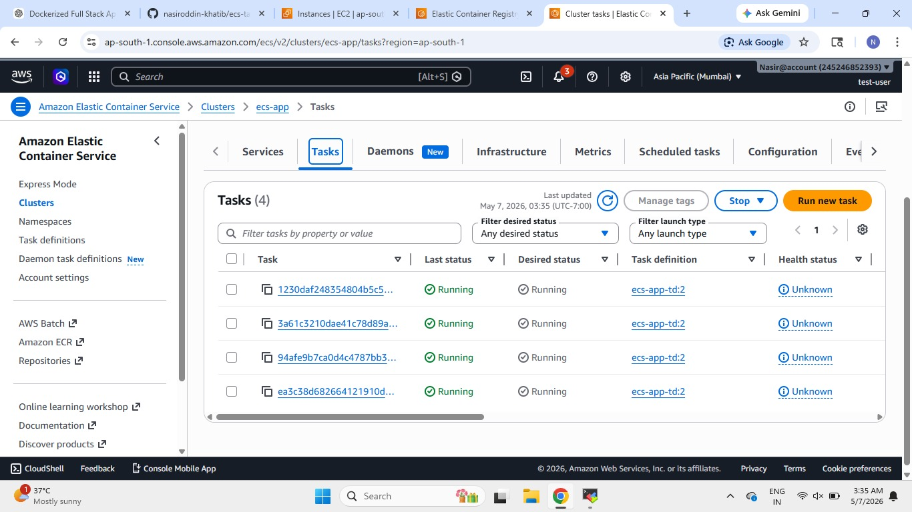
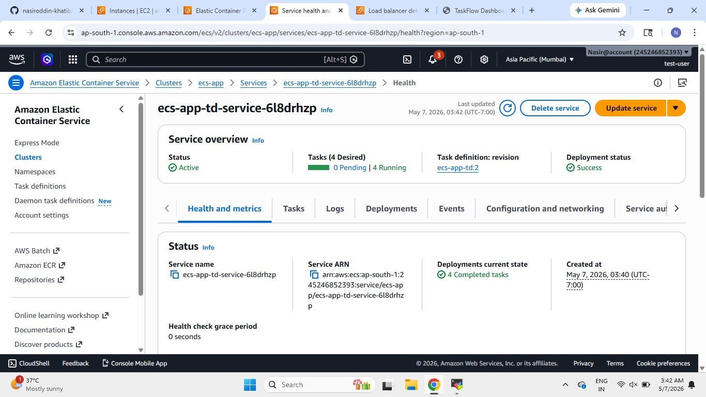
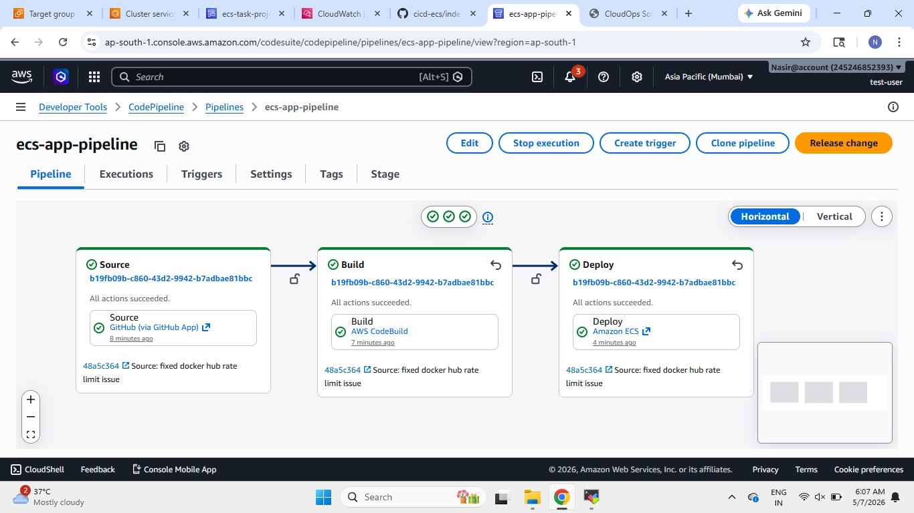
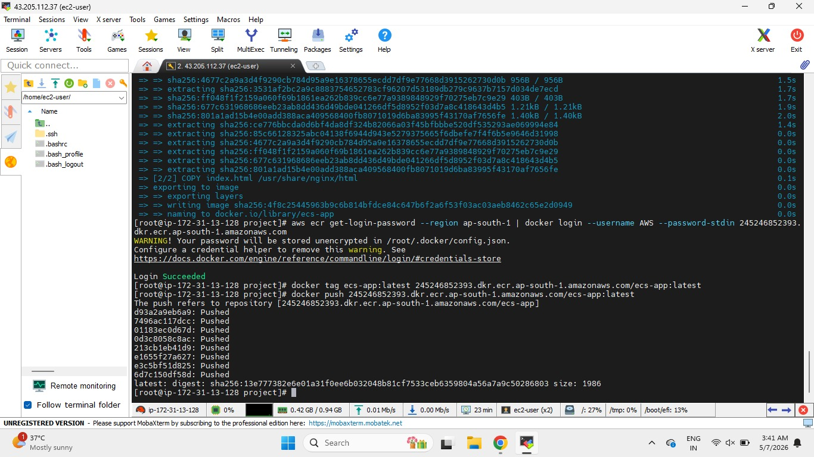
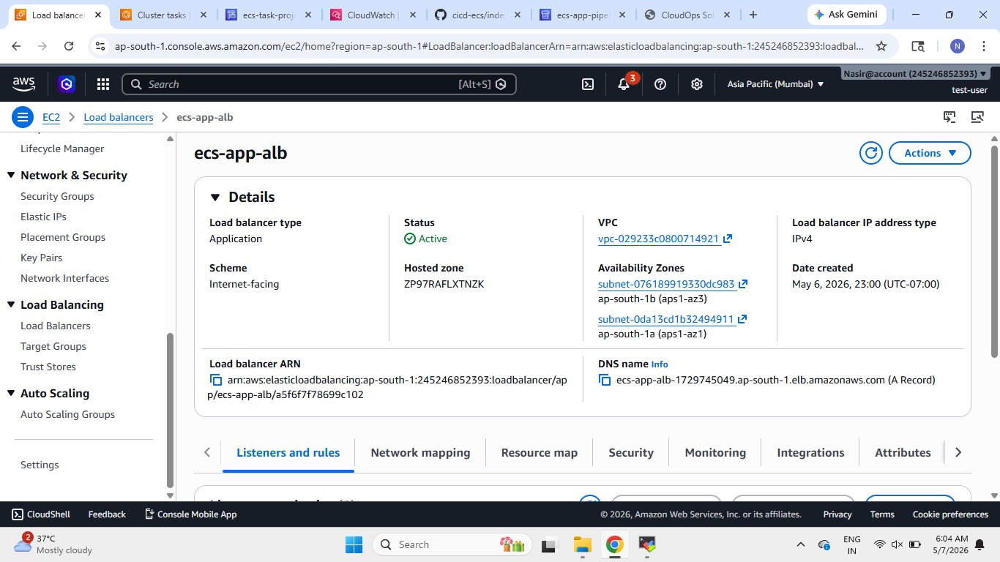
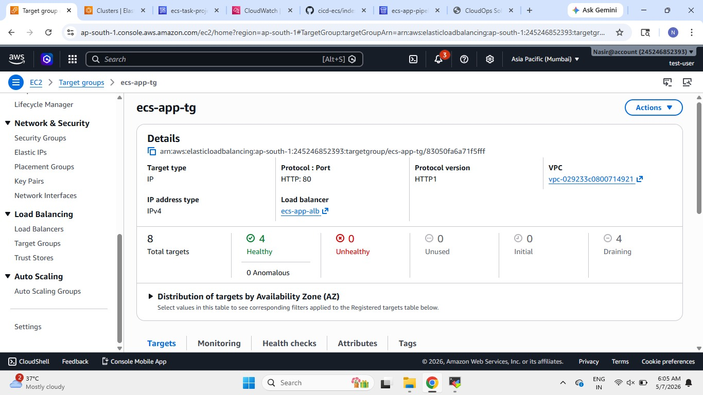
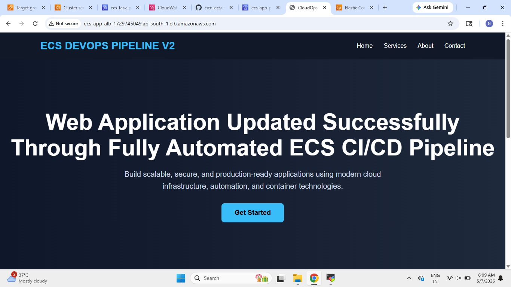

# 🚀 AWS ECS CI/CD Pipeline Project

## 📌 Project Overview

This project demonstrates a fully automated CI/CD pipeline deployment on AWS using:

- AWS CodePipeline
- AWS CodeBuild
- Amazon ECR
- Amazon ECS (Fargate)
- Application Load Balancer (ALB)
- Docker
- GitHub

The pipeline automatically builds, pushes, and deploys containerized applications whenever code changes are pushed to the GitHub repository.

---

# 🏗️ Architecture

```text
GitHub Repository
        │
        ▼
AWS CodePipeline
        │
        ▼
AWS CodeBuild
(Build Docker Image)
        │
        ▼
Amazon ECR
(Store Docker Image)
        │
        ▼
Amazon ECS Fargate
(Deploy Containers)
        │
        ▼
Application Load Balancer
        │
        ▼
Web Application
```

---

# ⚙️ AWS Services Used

| Service | Purpose |
|---|---|
| CodePipeline | Automates CI/CD workflow |
| CodeBuild | Builds Docker image |
| Amazon ECR | Stores Docker images |
| Amazon ECS Fargate | Runs containers |
| Application Load Balancer | Exposes application publicly |
| IAM | Access management |
| CloudWatch | Monitoring and logs |

---

# 📂 Project Structure

```text
aws-ecs-codepipeline-project/
│
├── Dockerfile
├── buildspec.yml
├── index.html
├── README.md
│
└── Screenshots/
    ├── pipeline.jpg
    ├── service.jpg
    ├── tasks.jpg
    ├── load-balancer.jpg
    ├── Target-group.jpg
    ├── ecs-app-pipeline.jpg
    └── image-pushed-to-ecr.jpg
```

---

# 🐳 Dockerfile

```dockerfile
FROM public.ecr.aws/nginx/nginx:latest

COPY index.html /usr/share/nginx/html

EXPOSE 80
```

---

# 🔨 BuildSpec File

```yaml
version: 0.2

phases:
  pre_build:
    commands:
      - echo Logging in to Amazon ECR...
      - aws ecr get-login-password --region ap-south-1 | docker login --username AWS --password-stdin 245246852393.dkr.ecr.ap-south-1.amazonaws.com
      - REPOSITORY_URI=245246852393.dkr.ecr.ap-south-1.amazonaws.com/ecs-app
      - IMAGE_TAG=latest

  build:
    commands:
      - echo Build started on `date`
      - echo Building Docker image...
      - docker build -t ecs-app:latest .
      - docker tag ecs-app:latest $REPOSITORY_URI:$IMAGE_TAG

  post_build:
    commands:
      - echo Build completed on `date`
      - echo Pushing Docker image...
      - docker push $REPOSITORY_URI:$IMAGE_TAG
      - echo Writing imagedefinitions.json file...
      - printf '[{"name":"ecs-app-container","imageUri":"%s"}]' $REPOSITORY_URI:$IMAGE_TAG > imagedefinitions.json

artifacts:
  files:
    - imagedefinitions.json
```

---

# 🚀 Deployment Workflow

## Step 1 — Push Code to GitHub

Developer pushes updated application code to GitHub repository.

---

## Step 2 — CodePipeline Triggered

AWS CodePipeline automatically detects GitHub changes.

---

## Step 3 — CodeBuild Starts

CodeBuild:
- Builds Docker image
- Tags image
- Pushes image to Amazon ECR

---

## Step 4 — ECS Deployment

Amazon ECS service pulls the latest image from ECR and deploys updated containers.

---

## Step 5 — Application Accessible

Application becomes available through the Application Load Balancer DNS URL.

---

# 🌐 Application Features

- Responsive UI
- Cloud-native deployment
- Containerized application
- Fully automated deployment
- Zero manual deployment after pipeline setup

---

# 📸 Project Screenshots

## 🔹 ECS Tasks Running



---

## 🔹 ECS Service



---

## 🔹 CodePipeline Success



---

## 🔹 Docker Image Pushed to ECR



---

## 🔹 Application Load Balancer



---

## 🔹 Target Group Health



---

## 🔹 Web Application Successfully Updated



---

# 🎯 Key Learning Outcomes

- CI/CD pipeline implementation on AWS
- Docker containerization
- ECS Fargate deployment
- ECR image management
- Automated deployments using CodePipeline
- Load balancing using ALB
- Infrastructure automation concepts

---

# 👨‍💻 Author

## Nasiroddin Khatib

AWS & DevOps Enthusiast

---
